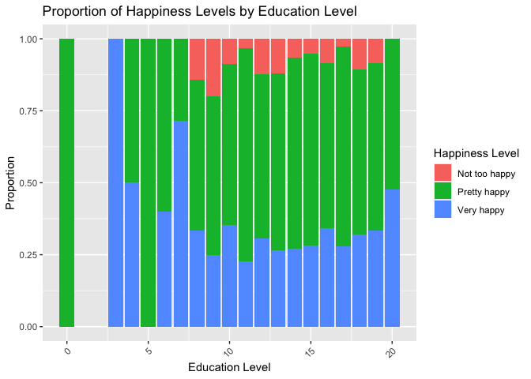
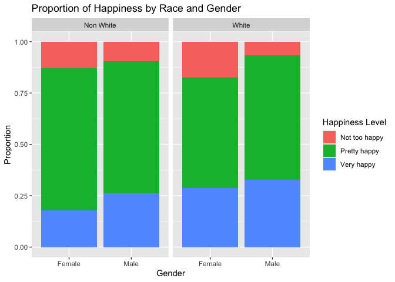

Data obtained from [GSS Data
Explorer](https://gssdataexplorer.norc.org/); you can also access it in
within [this
repository](https://raw.githubusercontent.com/kwlyu/stat230-f24-final-project/main/GSS_commute_happiness.csv).

## Data Wrangling

``` r
happiness_raw <- read_csv("GSS_commute_happiness.csv")

happiness_cleaned <- happiness_raw %>%
  select(year, happy, commute, realrinc, educ, race, gender1) %>% 
  filter(commute != ".i:  Inapplicable",
         realrinc > 0,
         happy != ".n:  No answer") %>% 
  mutate(
    educ = case_when(
      str_detect(educ, "grade") ~ as.numeric(str_extract(educ, "\\d+")),
      str_detect(educ, "college") ~ as.numeric(str_extract(educ, "\\d+")) + 12,
      str_detect(educ, "No formal schooling") ~ 0,
      TRUE ~ NA
    ),
    commute = case_when(
      str_detect(commute, "\\d+") ~ as.numeric(str_extract(commute, "\\d+")),
      TRUE ~ NA
    ),
    race = if_else(race == "White", "White", "Non White"),
    gender = if_else(gender1 == "MALE", "Male", "Female")
  ) %>% 
  select(-gender1)

happiness_recode <- happiness_cleaned %>% 
  mutate(happy = if_else(happy == "Not too happy", 0, 1))
```

## EDA

``` r
ggpairs(happiness_cleaned)
```

<!-- -->

``` r
# Density plot for happiness by commute time
ggplot(happiness_cleaned, aes(x = happy, y = commute, fill = happy)) +
  geom_boxplot() +
  labs(title = "Commute Time Distribution by Happiness Level", 
       x = "Commute Time (minutes)", 
       fill = "Happiness Level")
```

<!-- -->

``` r
# Boxplot of income by happiness level
ggplot(happiness_cleaned, aes(x = happy, y = realrinc, fill = happy)) +
  geom_boxplot() +
  labs(title = "Income Distribution by Happiness Level", 
       x = "Happiness Level", 
       y = "Real Income",
       fill = "Happiness Level")
```

<!-- -->

``` r
# Bar plot of happiness level by education level
ggplot(happiness_cleaned, aes(x = educ, fill = happy)) +
  geom_bar(position = "fill") +
  labs(title = "Proportion of Happiness Levels by Education Level", 
       x = "Education Level", 
       y = "Proportion",
       fill = "Happiness Level") +
  theme(axis.text.x = element_text(angle = 45, hjust = 1))
```

<!-- -->

``` r
# Faceted bar plot for happiness levels by race and gender
ggplot(happiness_cleaned, aes(x = gender, fill = happy)) +
  geom_bar(position = "fill") +
  facet_wrap(~ race) +
  labs(title = "Proportion of Happiness by Race and Gender", 
       x = "Gender", 
       y = "Proportion",
       fill = "Happiness Level")
```

<!-- -->

## Logistic Regression

``` r
happiness_glm <- glm(happy ~ commute + realrinc + educ + race + gender, 
                     data = happiness_recode, family = binomial)

summary(happiness_glm)
```

    ## 
    ## Call:
    ## glm(formula = happy ~ commute + realrinc + educ + race + gender, 
    ##     family = binomial, data = happiness_recode)
    ## 
    ## Coefficients:
    ##               Estimate Std. Error z value Pr(>|z|)   
    ## (Intercept)  1.2207687  0.6436418   1.897  0.05787 . 
    ## commute     -0.0013295  0.0075192  -0.177  0.85965   
    ## realrinc     0.0000373  0.0000118   3.161  0.00157 **
    ## educ        -0.0002136  0.0463060  -0.005  0.99632   
    ## raceWhite    0.0111056  0.3322843   0.033  0.97334   
    ## genderMale   0.7433165  0.2509178   2.962  0.00305 **
    ## ---
    ## Signif. codes:  0 '***' 0.001 '**' 0.01 '*' 0.05 '.' 0.1 ' ' 1
    ## 
    ## (Dispersion parameter for binomial family taken to be 1)
    ## 
    ##     Null deviance: 530.41  on 873  degrees of freedom
    ## Residual deviance: 503.81  on 868  degrees of freedom
    ##   (19 observations deleted due to missingness)
    ## AIC: 515.81
    ## 
    ## Number of Fisher Scoring iterations: 6
